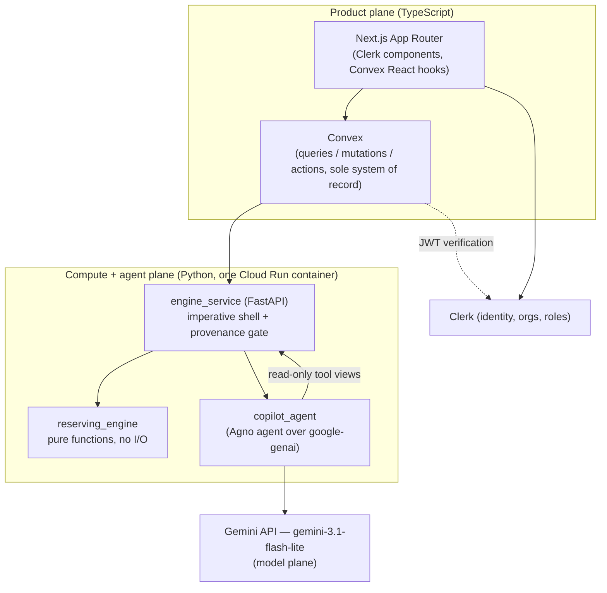
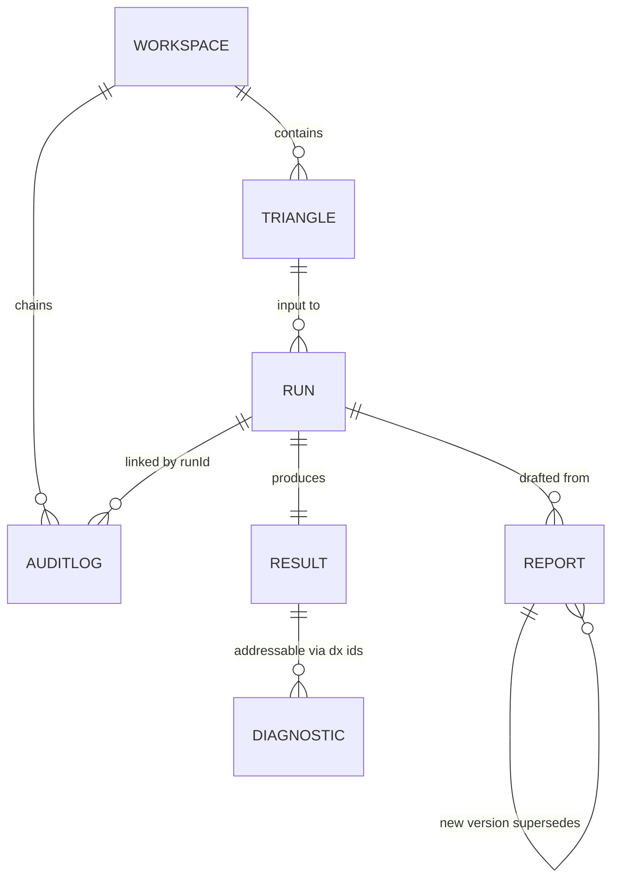

# Architecture Spine — Reserving Copilot

## Design Paradigm

**Layered three-plane system** (TypeScript product plane, Python computation+agent plane, model plane), with **functional core / imperative shell** governing the Python plane: `reserving_engine` is the pure functional core — deterministic, no I/O, no clock, no network — and `engine_service` is its only imperative shell. On the product plane, Convex is the sole system of record and the Next.js app is a reactive view over it.



Dependency direction is strict and downward as drawn. Nothing calls upward: `reserving_engine` imports nothing from `engine_service`; `engine_service` never calls Convex or Clerk; the browser never calls `engine_service`; the model plane is reached only through `copilot_agent`.

## Invariants & Rules

### AD-1 — Numbers originate only in the engine `[ADOPTED]`

- **Binds:** all (PRD §5 constitution, FR-5, FR-11)
- **Prevents:** any component quietly becoming a second source of figures — the LLM, the frontend, a Convex function, or a report template doing arithmetic.
- **Rule:** every number shown, stored, or exported is a value from a schema-validated ResultSet or DiagnosticsBundle produced by `reserving_engine`. No arithmetic on reserve figures anywhere else — not in Convex functions, not in React components (display formatting only), not in prompts, not in export code.

### AD-2 — Functional core: `reserving_engine` is pure `[ADOPTED]`

- **Binds:** `reserving_engine`, `engine_service`
- **Prevents:** engine logic growing I/O, config reads, or service coupling that breaks determinism and golden-testability.
- **Rule:** `reserving_engine` functions take plain data in (triangle arrays, parameters) and return typed, JSON-serialisable results (ResultSet, DiagnosticsBundle, validation reports). No file, network, environment, or clock access; no logging side effects. All I/O, HTTP, retries, auth, and LLM traffic live in `engine_service`. **Diagnostics computation lives in `reserving_engine`** (it produces numbers, so it belongs to the golden-tested core); `engine_service`'s diagnostics module is only the HTTP/serialisation view.

### AD-3 — Convex is the sole system of record `[ADOPTED]`

- **Binds:** all persistence (triangles, runs, results, reports, auditLogs)
- **Prevents:** dual sources of truth — agent session state, engine-side caches, or files becoming an unreconciled second store.
- **Rule:** `engine_service` is stateless between requests; anything worth keeping (ResultSet, DiagnosticsBundle, interpretation output, audit events) is returned to the calling Convex action and persisted there. Agent conversation state is transient per interpretation request and reconstructable from the Audit Log.

### AD-4 — Every Convex function is auth-guarded `[ADOPTED]`

- **Binds:** all Convex queries, mutations, actions (FR-17, FR-18, FR-19, NFR-3)
- **Prevents:** one public function shipping without identity/tenancy/role checks; UI-only enforcement.
- **Rule:** every public function's first statement is `requireMember(ctx, workspaceId)` (verified Clerk identity + membership in the Clerk org that is the Workspace); approve/publish/override paths call `requireRole(ctx, workspaceId, "senior_actuary")`. Roles come from Clerk org roles in the JWT (template name `convex`); no role state duplicated into Convex tables. An automated test enumerates public functions and asserts unauthenticated rejection.

### AD-5 — Provenance Gate: template injection first, numeric checker second `[ADOPTED]`

- **Binds:** `copilot_agent`, `engine_service`, report rendering (FR-10, FR-11)
- **Prevents:** the LLM emitting or altering figures; a draft with unsourced numbers reaching a reviewer.
- **Rule:** the agent's draft carries **placeholders, never final figures**: `{{rs:<runId>:<method>:<origin>:<field>}}` and citation chips `{{dx:<diagnosticId>}}`. `engine_service` renders placeholders from the ResultSet/DiagnosticsBundle, then runs the checker: every numeric token in the rendered draft must match a source value under the canonicalization rule (documented rounding/formatting; whitelist for structural numerals such as headings and dates), and every claim must cite ≥1 resolvable Diagnostic ID. A failing draft is never persisted as reviewable; the rejection is audit-logged. Prompt instructions are not a substitute for this gate. **Scope boundary:** the gate governs machine-drafted content only; subsequent human edits are human-owned and audit-logged, and the approver signs the exact content version (FR-13) — the gate is not re-run on human edits.

### AD-6 — auditLogs is append-only and hash-chained `[ADOPTED]`

- **Binds:** Convex `auditLogs` (FR-15, NFR-5)
- **Prevents:** multiple write paths with divergent entry shapes; silent mutation of the record.
- **Rule:** exactly one internal mutation, `appendAuditEntry`, writes to `auditLogs`; no code path patches or deletes rows (verified by test). Entries form a per-Workspace chain: `hash = sha256(canonicalJSON(entry) + prevHash)`; Convex OCC serializes concurrent appends (retry on conflict). Every LLM interaction (full prompt, each tool call/result, response), gate rejection, run event, report edit, override, approval, export, and mode transition lands here with `workspaceId`, `runId` (where applicable), and actor. A verification query re-walks the chain.

### AD-7 — Job-record-first orchestration, idempotent by run ID `[ADOPTED]`

- **Binds:** Convex actions, `engine_service` endpoints (FR-4, NFR-4)
- **Prevents:** retries double-computing or producing divergent results; status truth living in two places.
- **Rule:** the Convex `runs` record is created first and is the sole authority on status (`queued | running | complete | failed`). The Convex action (via `@convex-dev/workflow` for durability/retries) calls `engine_service` synchronously with the Convex run ID as idempotency key; `engine_service` is stateless and deterministic, so retries are safe by construction. The HTTP contract is shaped so an async `202 + HMAC-signed callback` upgrade is additive, not a rewrite.

### AD-8 — Agent tools are read-only views over validated output `[ADOPTED]`

- **Binds:** `copilot_agent` (FR-9)
- **Prevents:** the agent acquiring a write path, raw-file access, or data beyond the Run.
- **Rule:** the agent's tool surface exposes only typed read views over the current Run's ResultSet and DiagnosticsBundle (plus their metadata) already held in `engine_service` memory for that request — no filesystem, no network, no Convex access, no write operations. Tool schemas and prompts are kept **provider-neutral** (plain JSON Schema); Agno's model abstraction is the only provider-specific seam, and its Gemini integration sits on the official `google-genai` SDK, which absorbs Gemini 3.x thought-signature handling in tool loops — never call the model API raw. The model ID (`gemini-3.1-flash-lite`) is config, so a swap stays a contained change. Every tool call and result is captured for the Audit Log.

### AD-9 — Interpretation fails closed into Engine-Only Mode

- **Binds:** `engine_service`, Convex, frontend (FR-12, NFR-2, PRD §8 cost ceiling)
- **Prevents:** a model outage or cost overrun blocking the quarter, or degrading output quality silently.
- **Rule:** interpretation is strictly additive to the engine workflow. Persistent model-API failure or hitting the per-Run token/cost ceiling fails the Interpretation cleanly (status on the run record, mode transition audit-logged); ingestion, runs, diagnostics, manual report drafting from the template shell remain fully functional. Engine-Only Mode is a derived server-side status, never a client-side guess.

### AD-10 — Shared cross-runtime contracts are versioned and single-sourced

- **Binds:** `reserving_engine`, `engine_service`, Convex schema, frontend (FR-5, FR-7)
- **Prevents:** Python and TypeScript drifting on the shapes both sides parse — ResultSet, DiagnosticsBundle, Diagnostic ID.
- **Rule:** ResultSet and DiagnosticsBundle are Pydantic models in `reserving_engine` carrying a `schemaVersion`; the JSON Schema they export is the contract the Convex validators and TS types are generated/checked against (a CI check diffs them). Diagnostic ID format is fixed: `dx:{runId}:{kind}:{key}` with `kind ∈ {ldf_stability, ave, cl_bf_divergence, residual}` and `key` the origin/development coordinate; IDs are generated only by `reserving_engine` and resolvable by both the Convex diagnostics query and the agent read tool. A ResultSet failing schema validation is never stored (run marked failed).

### AD-11 — Reproducibility: pinned platform exact, cross-platform epsilon

- **Binds:** `reserving_engine`, Lineage, golden tests (FR-6, NFR-1, NFR-6)
- **Prevents:** two builders picking different tolerance semantics; unpinned deps breaking re-derivation.
- **Rule:** dependencies are pinned via `uv.lock`; the CI and Cloud Run image share one platform (linux/amd64), on which golden tests (Taylor-Ashe) and re-derivation assert **exact** equality for point estimates. Cross-platform re-derivation is documented at relative tolerance 1e-8. Lineage on every ResultSet records engine semver, chainladder version, triangle sha256, and all parameters (including a priori loss ratios).

### AD-12 — Service boundary auth: only Convex may call the engine service

- **Binds:** `engine_service`, Convex actions
- **Prevents:** the browser (or the agent, or anyone with the URL) reaching engine endpoints directly, bypassing tenancy and audit.
- **Rule:** every `engine_service` endpoint requires the shared service bearer secret held only in Convex and Cloud Run env; `engine_service` performs no user auth and trusts the caller's already-authorized context. The frontend never holds the engine URL or secret.

## Consistency Conventions

| Concern | Convention |
| --- | --- |
| Vocabulary | PRD §3 Glossary terms used exactly, in code identifiers too (`Triangle`, `Run`, `ResultSet`, `Diagnostic`, `Lineage`, `Workspace`) |
| Naming | Python: snake_case modules `reserving_engine/`, `engine_service/`, `copilot_agent/`; Convex: camelCase functions grouped per table file (`convex/runs.ts`); tables plural camelCase (`auditLogs`) |
| IDs | Convex document IDs everywhere on the product plane; `runId` is the cross-runtime correlation and idempotency key; Diagnostic IDs per AD-10 |
| Hashes | Two distinct hashes, never conflated: raw-file sha256 for byte-identical duplicate detection at upload (FR-1); canonical-triangle-JSON sha256 is *the* Triangle hash recorded in Lineage and used for re-derivation (FR-6, AD-11) |
| Data & formats | JSON everywhere across boundaries; dates ISO-8601 UTC; money as floats from the engine, formatted only at display; error envelope `{code, message, details?}` on engine_service; validation errors carry cell-level `{origin, dev, reason}` |
| State mutation | Product plane state changes only via Convex mutations; run status only via the orchestration path (AD-7); published reports immutable — changes create a new version |
| Auth | `requireMember` / `requireRole` guards per AD-4; role slugs `analyst`, `senior_actuary` (Clerk org roles) |
| Config & secrets | Model ID, token/cost ceiling = engine_service env config; secrets never in the repo or the frontend bundle (AD-12) |
| Logging/audit | Consequential events via `appendAuditEntry` only (AD-6); operational logs (Cloud Run, Convex) are not the audit trail |
| Latency budgets (NFR-7) | Engine run ≤ 60 s end-to-end p95 for triangles ≤ 30 Origin Periods (compute itself is sub-second; budget covers orchestration); Interpretation ≤ 10 min hard-bounded by the per-Run ceiling (AD-9) — breach fails the Interpretation, never queues silently |
| Testing | pytest + Taylor-Ashe golden masters and Hypothesis property tests (triangle validation) in `reserving_engine`; convex-test + Vitest for every Convex function incl. auth-guard enumeration and append-only checks; one Playwright smoke of the authenticated golden path |

## Stack

| Name | Version |
| --- | --- |
| Python (uv-managed) | 3.11+ |
| chainladder | 0.9.2 |
| pandas | pinned via uv.lock (chainladder-compatible) |
| FastAPI | 0.139.0 |
| agno | 2.x (2.5.17 verified current; lockfile-pinned at scaffold) |
| google-genai (official Gemini SDK, via Agno) | latest at scaffold, then uv.lock-pinned |
| Gemini model | gemini-3.1-flash-lite (config value) |
| Node / Next.js (App Router) | Next.js 16.2.x |
| convex (npm) | latest at scaffold, then lockfile-pinned |
| @convex-dev/workflow | 0.3.10 |
| Clerk (`@clerk/nextjs` + Convex JWT template) | latest at scaffold, then lockfile-pinned |
| shadcn/ui + Tailwind | per UX DESIGN.md |
| pytest + Hypothesis / Vitest + convex-test / Playwright | latest at scaffold, then lockfile-pinned |

## Structural Seed

```text
agentic-reserving/
  engine/                      # Python plane — one uv project, one Cloud Run image
    reserving_engine/          # pure core: methods, diagnostics, validation, schemas (Pydantic)
    engine_service/            # FastAPI shell: routes, service auth, provenance gate, config
    copilot_agent/             # Agno agent (google-genai under the hood) + read-only tool views
    tests/                     # golden masters (Taylor-Ashe), property tests, gate tests
  convex/                      # schema.ts, auth guards, per-table functions, actions, auditLog
  app/                         # Next.js App Router (Clerk components, Convex hooks)
  components/                  # shadcn/ui + brand layer per UX DESIGN.md
```



Deployment: Next.js on Vercel; Convex cloud (dev + prod deployments); `engine/` as one container on Cloud Run (min instances ≥ 1 to avoid cold-start on run submission is a tuning knob, not an invariant). Environments: local (`convex dev` + uvicorn), preview (Vercel preview + Convex preview deployment + shared dev engine), prod. Secrets: `GEMINI_API_KEY` + service secret in Cloud Run only; Clerk keys in Vercel + Convex env; per AD-12.

## Capability → Architecture Map

| Capability / Area | Lives in | Governed by |
| --- | --- | --- |
| FR-1..3 ingestion & validation | Next.js upload flow → Convex mutation → `reserving_engine.validation` via engine_service | AD-1, AD-2, AD-10; OQ-6 open |
| FR-4..6 runs & ResultSet | Convex `runs` + action → engine_service → `reserving_engine.methods` | AD-2, AD-3, AD-7, AD-10, AD-11 |
| FR-7..8 diagnostics | `reserving_engine.diagnostics` → stored on run → diagnostics review UI | AD-2, AD-10 |
| FR-9..12 interpretation | `copilot_agent` hosted in engine_service | AD-1, AD-5, AD-8, AD-9 |
| FR-13..14 report workflow & export | Convex `reports` + Next.js review UI; .docx render server-side from published version | AD-1, AD-4, AD-5, conventions (immutable published) |
| FR-15..16 audit & lineage | Convex `auditLogs` + lineage on results | AD-6, AD-11 |
| FR-17..19 auth, workspaces, roles | Clerk + Convex guards | AD-4, AD-12 |
| FR-20 golden-path UI | Next.js App Router + Convex subscriptions | paradigm (reactive view), AD-3 |

## Deferred

- **Exact Convex table field lists** — the schema.ts owns them once written; the ERD names + AD-10 contracts are the invariant. Defer to the first backend epic.
- **.docx export library choice** (python-docx in engine_service vs a TS lib in a Convex action) — either satisfies AD-1 since it renders from stored, gated content; decide in the report epic.
- **Async 202 + HMAC callback activation** — contract headroom exists (AD-7); activate only if synchronous awaits hit Convex action time limits with real triangles. **Known gap tied to this:** under synchronous orchestration, an action crash mid-Interpretation loses the in-memory LLM transcript, denting NFR-5's 100% on that failure path; the failure itself is logged, but full-transcript durability under crash (incremental per-tool-turn flush, or engine-side spool returned on retry) lands with the async upgrade.
- **Observability/alerting beyond platform defaults** — Cloud Run, Convex, and Vercel dashboards suffice for v1; dedicated alerting (job failure rate vs NFR-4, model-API error budget) is a hardening-phase decision.
- **Per-Run token/cost ceiling values** — config, set at agent-layer eval. Provider is settled (PRD OQ-1 closed 2026-07-16: Gemini `gemini-3.1-flash-lite` via Agno, per the brief's original commitment); the model ID stays a config value, so a swap-up to a heavier Gemini model remains an eval-driven change.
- **Incurred-triangle validation rules** — needs actuarial confirmation (PRD OQ-6) before the ingestion epic hardens; monotonicity applies to paid only until then.
- **SSO (SAML/OIDC) enablement** — Clerk-config change by design (FR-17); no architecture work deferred with it.
- **Streaming interpretation output** — UX chose gated-complete display; revisit only on design-partner feedback.
